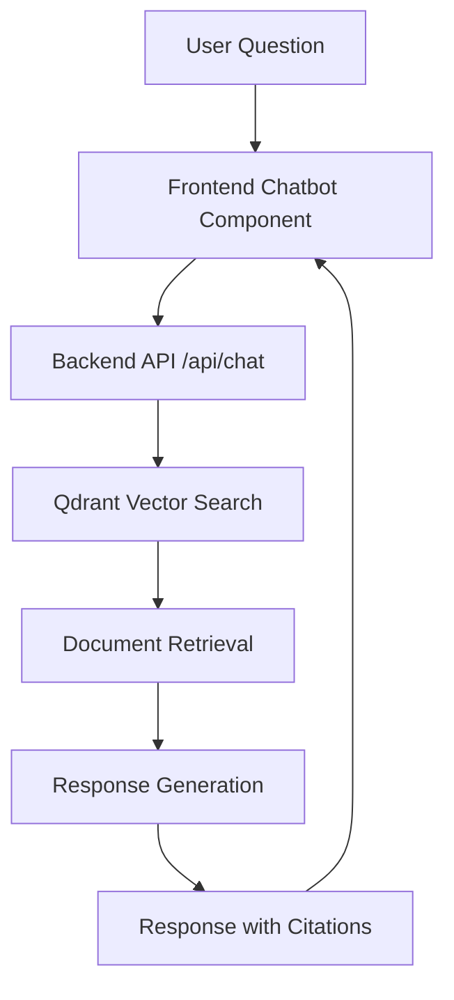

# Chatbot Integration Guide

The Physical AI & Humanoid Robotics book includes an integrated RAG (Retrieval-Augmented Generation) chatbot that allows users to ask questions about the book content and get responses based on the book's content only.

## Features

- **Floating Chatbot**: A chatbot that appears as a floating button on all pages
- **Context-Aware**: Can use selected text as context for questions
- **Citation Support**: All responses include citations to the original book content
- **Mobile-Friendly**: Responsive design works on all device sizes
- **Accessibility**: WCAG 2.1 AA compliant with keyboard navigation

## How to Use

### Asking Questions

1. Click the floating chat icon 💬 at the bottom right of any page
2. Type your question about the book content
3. The chatbot will search the book content and provide an answer with citations

### Using Selected Text as Context

1. Highlight text on any page
2. Open the chatbot
3. Ask a question about the highlighted text
4. The chatbot will use the selected text as additional context

## Technical Implementation

The chatbot is implemented using:

- **Frontend**: React component with TypeScript
- **Backend**: FastAPI with RAG pipeline
- **Vector Database**: Qdrant Cloud for document embeddings
- **LLM**: OpenAI GPT models for response generation
- **Framework**: Docusaurus v3.9.2 for documentation site

### Architecture



## API Endpoints

- `POST /api/chat` - Send a message and get a response
- `GET /api/health` - Health check endpoint

### Request Format

```json
{
  "query": "Your question here",
  "context": "Optional context from selected text",
  "conversation_id": "Unique conversation identifier"
}
```

### Response Format

```json
{
  "answer": "The answer to your question",
  "citations": [
    {
      "document_id": "unique document identifier",
      "source": "URL to the source",
      "text_snippet": "Relevant text snippet"
    }
  ],
  "conversation_id": "conversation identifier",
  "tokens_used": 123,
  "processing_time": 1.234
}
```

## Privacy and Data Handling

- No personal data is stored
- Conversation IDs are stored locally in browser storage
- All content processing happens server-side
- No tracking of user questions outside of local storage

## Troubleshooting

### Common Issues

- **Chatbot not appearing**: Check if ad blockers are enabled
- **API errors**: Verify backend server is running
- **Slow responses**: Network connectivity issues
- **No citations**: The book content may not contain relevant information

### Support

If you encounter issues with the chatbot, please [open an issue](https://github.com/physical-ai-humanoid-robotics-book/physical-ai-humanoid-robotics-book/issues) on our GitHub repository.